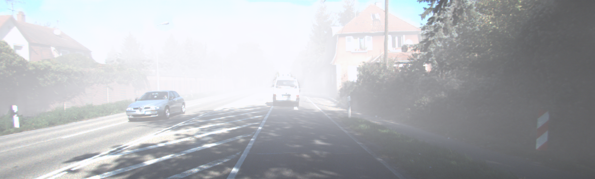
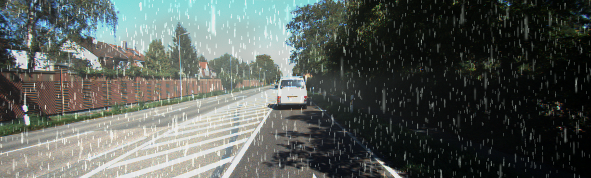
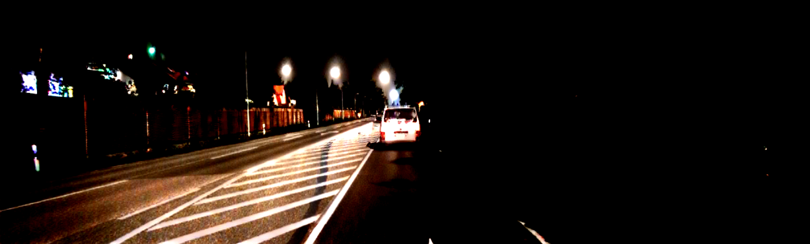
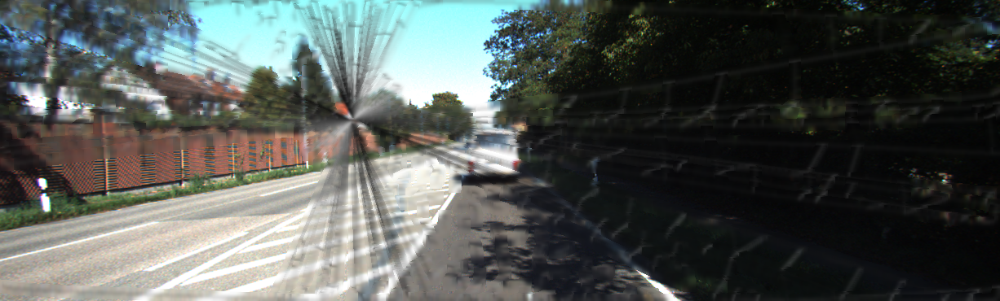

# SLAMAdverserialLab

SLAMAdverserialLab is a research framework for stress-testing visual SLAM systems under controlled visual degradation. It combines dataset adapters, perturbation modules, and backend-specific SLAM runners behind a single config-driven workflow.

> [!WARNING]
> SLAMAdverserialLab is a work-in-progress research prototype. It may contain bugs, performance issues, and other limitations. The interfaces and implementation may change over time.

## Contents

- [Showcase](#showcase)
- [What This Repo Is](#what-this-repo-is)
- [Repository Layout](#repository-layout)
- [Core Install](#core-install)
- [Optional Integrations](#optional-integrations)
- [Datasets](#datasets)
- [Running Experiments](#running-experiments)
- [Current Integrations](#current-integrations)
- [Extension Points](#extension-points)
- [Contributing](#contributing)
- [License](#license)
- [Citation](#citation)

## Showcase

Representative perturbations from the current pipeline:

<table>
  <tr>
    <td align="center"><b>Fog</b><br></td>
    <td align="center"><b>Rain</b><br></td>
  </tr>
  <tr>
    <td align="center"><b>Day to Night</b><br></td>
    <td align="center"><b>Cracked Lens</b><br></td>
  </tr>
</table>

More examples are in [`docs/images/`](docs/images), and the generated showcase video is [`docs/media/showcase.mp4`](docs/media/showcase.mp4).

## What This Repo Is

- A perturbation pipeline for generating degraded image sequences from SLAM datasets.
- A unified evaluation layer for multiple SLAM backends.
- A config-first workflow for experiments, sweeps, and regression checks.
- A codebase intended for extension at the dataset, module, and backend layers.

## Repository Layout

- `src/`: framework code, CLI, dataset adapters, perturbation modules, SLAM integrations.
- `configs/`: runnable experiment configurations and examples.
- `deps/`: tracked external dependencies and forked integrations.
- `scripts/`: setup helpers, analysis utilities, and regression scripts.
- `results/`: local outputs and generated artifacts.

## Core Install

### Prerequisites

- Python 3.9+
- `git`
- Optional, depending on what you run: `conda`, `docker`, `ffmpeg`, NVIDIA CUDA toolchain

### Minimal Setup

```bash
git clone https://github.com/mohhef/SLAMAdverserialLab.git
cd SLAMAdverserialLab

conda create -n slamadverseriallab python=3.10 -y
conda activate slamadverseriallab
pip install --upgrade pip
pip install -e .
```

If you already have an existing local environment for this repo, activate that instead of creating a new one.

### First Smoke Check

This validates the main config and CLI path without requiring datasets or heavyweight backends.

```bash
python -m slamadverseriallab run configs/slamadverseriallab/other/baseline_tum_desk.yaml --dry-run
python -m slamadverseriallab list-algorithms
python -m slamadverseriallab list-modules
```

## Optional Integrations

Initialize only the dependencies you need. A full recursive clone is unnecessary for most workflows.

### Perturbation Dependencies

| Integration | Needed For | Setup |
| --- | --- | --- |
| `Depth-Anything-V2` | `fog` depth estimation backends | `git submodule update --init deps/depth-estimation/Depth-Anything-V2` then `./scripts/download_depth_anything_v2_metric_checkpoints.sh` |
| `FoundationStereo` | stereo depth backends used by fog workflows | `git submodule update --init deps/depth-estimation/FoundationStereo` then `conda env create -f deps/depth-estimation/FoundationStereo/environment.yml` |
| `img2img-turbo` | `daynight` | `git submodule update --init deps/perturbations/img2img-turbo` then `pip install -r deps/perturbations/img2img-turbo/requirements.txt` |
| `rain-rendering` | `rain` | `git submodule update --init deps/perturbations/rain-rendering` then `docker build -t rain-rendering:latest -f deps/perturbations/rain-rendering/Dockerfile deps/perturbations/rain-rendering` |

### SLAM Backends

| Backend | Supported Datasets | Setup |
| --- | --- | --- |
| `orbslam3` | KITTI `mono/stereo`, TUM `mono/rgbd`, EuRoC `stereo` | `git submodule update --init deps/slam-algorithms/orbslam3-docker` then `docker build -t orbslam3:latest -f deps/slam-algorithms/orbslam3-docker/Dockerfile deps/slam-algorithms/orbslam3-docker` |
| `droidslam` | TUM `mono` | `git submodule update --init deps/slam-algorithms/DROID-SLAM` then `cd deps/slam-algorithms/DROID-SLAM && ./install_all.sh` |
| `gigaslam` | KITTI `mono` | `git submodule update --init deps/slam-algorithms/GigaSLAM` then `cd deps/slam-algorithms/GigaSLAM && ./install_all.sh` |
| `mast3rslam` | TUM `mono` | `git submodule update --init deps/slam-algorithms/MASt3R-SLAM` then `cd deps/slam-algorithms/MASt3R-SLAM && ./install_all.sh` |
| `photoslam` | TUM `mono/rgbd`, EuRoC `stereo` | `git submodule update --init deps/slam-algorithms/Photo-SLAM` then `cd deps/slam-algorithms/Photo-SLAM && ./install_all.sh` |
| `s3pogs` | KITTI `mono` | `git submodule update --init deps/slam-algorithms/S3PO-GS` then `cd deps/slam-algorithms/S3PO-GS && ./install_all.sh` |
| `vggtslam` | EuRoC `mono` | `git submodule update --init deps/slam-algorithms/VGGT-SLAM` then `cd deps/slam-algorithms/VGGT-SLAM && ./install_all.sh` |

### VO Evaluation Dependency

| Integration | Needed For | Setup |
| --- | --- | --- |
| `pyslam` | `evaluate-vo` feature-extractor evaluation | Requires `conda`. Run `git submodule update --init deps/slam-frameworks/pyslam` then `cd deps/slam-frameworks/pyslam && ./install_all.sh` |

## Datasets

Tracked code currently registers the following dataset adapters:

| Dataset | Type |
| --- | --- |
| `mock` | synthetic |
| `tum` | RGB-D |
| `kitti` | monocular/stereo |
| `euroc` | stereo |
| `7scenes` | RGB-D |

Datasets are expected to live outside the repository history, typically under `./datasets/`.

Example dataset config:

```yaml
dataset:
  type: tum
  sequence: "freiburg1_desk"
  path: ./datasets/TUM/rgbd_dataset_freiburg1_desk
```

## Running Experiments

### Simple Experiment

Experiment configs are plain YAML files with four main sections:

- `experiment`: metadata such as the run name and seed
- `dataset`: which dataset adapter to use and where the data lives
- `perturbations`: the ordered list of modules to apply
- `output`: where generated artifacts should be written

Minimal example:

```yaml
experiment:
  name: fog_tum_desk
  description: "Apply fog to TUM freiburg1_desk"
  seed: 42

dataset:
  type: tum
  sequence: "freiburg1_desk"
  path: ./datasets/TUM/rgbd_dataset_freiburg1_desk

perturbations:
  - name: fog_example
    type: fog
    enabled: true
    parameters:
      visibility_m: 50.0
      encoder: vitl
      max_depth_range: 80.0

output:
  base_dir: ./results
  save_images: true
  create_timestamp_dir: false
```

Run it with:

```bash
python -m slamadverseriallab run path/to/experiment.yaml
```

This example uses `fog`, so initialize the `Depth-Anything-V2` dependency first.

For module-specific parameter help, use:

```bash
python -m slamadverseriallab list-modules --module fog
python -m slamadverseriallab list-modules --module fog --format yaml
```

### Generate Perturbed Data

Use `run` to materialize perturbed image sequences from an experiment config. This is the data-generation step you do before SLAM or VO evaluation.

```bash
python -m slamadverseriallab run configs/slamadverseriallab/other/baseline_tum_desk.yaml --dry-run
python -m slamadverseriallab run configs/slamadverseriallab/other/example_day_to_night_kitti.yaml
```

The non-dry-run examples require the referenced dataset plus any optional module dependencies.

### Evaluate a SLAM Backend

```bash
python -m slamadverseriallab evaluate \
  configs/slamadverseriallab/other/baseline_tum_desk.yaml \
  --slam orbslam3 \
  --mode full
```

This requires the dataset to be present locally and the selected SLAM backend to be installed first.

Use `--slam-config-path` when you need an explicit backend config instead of the inferred internal one.

### Evaluate Feature-Extractor VO with PySLAM

Use `evaluate-vo` to compare feature-extractor behavior through the `pyslam` integration on baseline and perturbed data. This is separate from the backend-specific SLAM evaluation flow above.

```bash
python -m slamadverseriallab evaluate-vo \
  configs/slamadverseriallab/other/example_day_to_night_kitti.yaml \
  --features ORB2,SIFT \
  --sensor-type stereo \
  --skip-run
```

Use `evaluate-vo` when you want feature-extractor-level VO comparisons through the `pyslam` integration rather than the backend-specific SLAM runners. Remove `--skip-run` after `deps/slam-frameworks/pyslam` is installed and configured.

The `pyslam` installer requires `conda` and creates the conda environment `pyslam`, which is what `evaluate-vo` expects at runtime.

### Search a Robustness Boundary

Use `--mode robustness-boundary` when you want to rerun one experiment while varying a single searchable perturbation parameter until the pass/fail boundary is bracketed.

Add a `robustness_boundary` block to a normal experiment file, like the simple experiment shown above:

```yaml
robustness_boundary:
  enabled: true
  name: tum_framedrop_boundary
  target_perturbation: framedrop_boundary_target  # enabled perturbation being searched
  module: frame_drop
  parameter: drop_rate
  lower_bound: 10
  upper_bound: 50
  tolerance: 3
  max_iters: 10
  ate_rmse_fail: 0.5  # trajectory error threshold for a failed trial
  fail_on_tracking_failure: false  # true: tracking loss fails immediately; false: classify by ATE threshold
```

Run it with:

```bash
python -m slamadverseriallab evaluate \
  path/to/boundary_experiment.yaml \
  --slam droidslam \
  --mode robustness-boundary
```

Notes:

- `output.save_images` must be `true`
- boundary mode runs one SLAM backend at a time
- current searchable parameters are:
  - `fog.visibility_m`
  - `rain.intensity`
  - `frame_drop.drop_rate`
  - `speed_blur.speed`

Results are written under `results/<experiment>/robustness_boundary/<slam_algorithm>/...`, with a machine-readable summary in `boundary_summary.json`.

### Discover Backends and Modules

```bash
python -m slamadverseriallab list-algorithms
python -m slamadverseriallab list-algorithms --algorithm orbslam3
python -m slamadverseriallab list-modules
python -m slamadverseriallab list-modules --detailed
python -m slamadverseriallab list-modules --module fog
python -m slamadverseriallab list-modules --module fog --format yaml
```

Use `list-modules --module <name>` for parameter documentation and
`list-modules --module <name> --format yaml` for a starter experiment snippet.

## Current Integrations

### SLAM Algorithms

| Algorithm | Datasets | Integration Class |
| --- | --- | --- |
| `orbslam3` | KITTI `mono/stereo`, TUM `mono/rgbd`, EuRoC `stereo` | [`ORBSLAM3Algorithm`](src/algorithms/orbslam3.py) |
| `droidslam` | TUM `mono` | [`DROIDSLAMAlgorithm`](src/algorithms/droidslam.py) |
| `gigaslam` | KITTI `mono` | [`GigaSLAMAlgorithm`](src/algorithms/gigaslam.py) |
| `mast3rslam` | TUM `mono` | [`MASt3RSLAMAlgorithm`](src/algorithms/mast3rslam.py) |
| `photoslam` | TUM `mono/rgbd`, EuRoC `stereo` | [`PhotoSLAMAlgorithm`](src/algorithms/photoslam.py) |
| `s3pogs` | KITTI `mono` | [`S3POGSAlgorithm`](src/algorithms/s3pogs.py) |
| `vggtslam` | EuRoC `mono` | [`VGGTSLAMAlgorithm`](src/algorithms/vggtslam.py) |

### Perturbation Modules

Use `python -m slamadverseriallab list-modules --module <name>` for parameter-level documentation. The README keeps only the stable module-to-class mapping.

| Module | Class | File | Notes |
| --- | --- | --- | --- |
| `cracked_lens` | `CrackedLensPhysicsModule` | [`src/modules/optics/cracked_lens_physics.py`](src/modules/optics/cracked_lens_physics.py) | physics-based crack and stress propagation |
| `daynight` | `DayNightModule` | [`src/modules/scene/daynight.py`](src/modules/scene/daynight.py) | uses `img2img-turbo` |
| `flickering` | `FlickerModule` | [`src/modules/optics/flickering.py`](src/modules/optics/flickering.py) | brightness and contrast flicker |
| `fog` | `FogModule` | [`src/modules/scene/fog.py`](src/modules/scene/fog.py) | depth-aware fog |
| `frame_drop` | `FrameDropModule` | [`src/modules/transport/frame_drop.py`](src/modules/transport/frame_drop.py) | temporal sparsification |
| `lens_flare` | `LensFlareModule` | [`src/modules/optics/lens_flare.py`](src/modules/optics/lens_flare.py) | glare and flare artifacts |
| `lens_patch` | `LensPatchModule` | [`src/modules/optics/lens_patch.py`](src/modules/optics/lens_patch.py) | patch or occlusion overlay |
| `lens_soiling` | `LensSoilingModule` | [`src/modules/optics/lens_soiling.py`](src/modules/optics/lens_soiling.py) | dirt, droplets, bokeh |
| `network_degradation` | `NetworkDegradationModule` | [`src/modules/transport/network_degradation.py`](src/modules/transport/network_degradation.py) | bandwidth-driven transport degradation |
| `rain` | `RainModule` | [`src/modules/scene/rain.py`](src/modules/scene/rain.py) | physics-based rain rendering |
| `speed_blur` | `SpeedBlurModule` | [`src/modules/optics/speed_blur.py`](src/modules/optics/speed_blur.py) | forward-motion blur model |
| `vignetting` | `VignetteModule` | [`src/modules/optics/vignetting.py`](src/modules/optics/vignetting.py) | edge darkening |

Deprecated modules stay available through the registry but are hidden from the default listing.

## Extension Points

If you want to add new components, use the framework interfaces and config/schema contracts as the source of truth.

- Datasets: implement [`BaseDataset`](src/datasets/base.py) and register in [`src/datasets/factory.py`](src/datasets/factory.py)
- SLAM backends: implement [`SLAMAlgorithm`](src/algorithms/base.py) and register in [`src/algorithms/registry.py`](src/algorithms/registry.py)
- Perturbation modules: subclass [`PerturbationModule`](src/modules/base.py) and expose a stable `module_name`

## Contributing

See [`CONTRIBUTING.md`](CONTRIBUTING.md) for contribution scope, setup, testing, and submodule guidance.

## License

MIT License. See [`LICENSE`](LICENSE).

## Citation

If you use SLAMAdverserialLab in your research, cite:

```bibtex
@software{slamadverseriallab2026,
  title = {SLAMAdverserialLab: A Framework for Visual Perturbation-based SLAM Evaluation},
  year = {2026},
  url = {https://github.com/mohhef/SLAMAdverserialLab}
}
```
