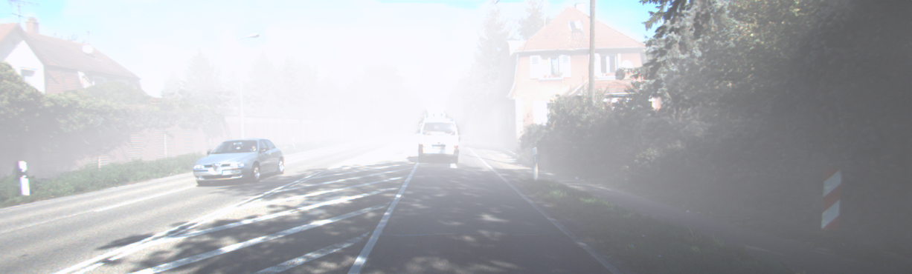
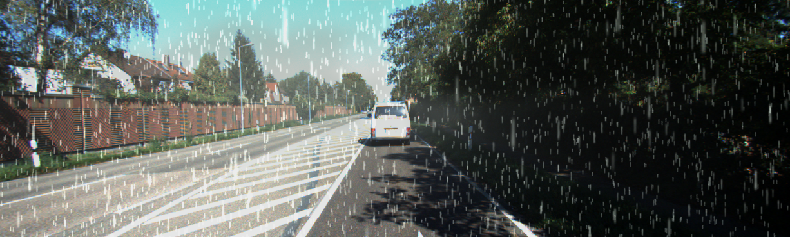
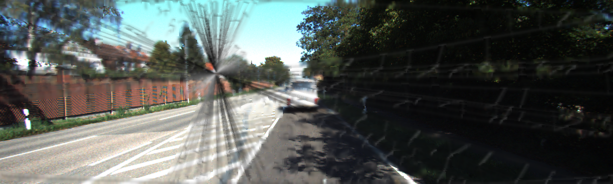

# SLAMAdversarialLab

This repository hosts two evaluation frameworks for visual SLAM. They share the
dataset adapters, the SLAM backends and the config-driven workflow, and differ
in what they degrade.

| | what it degrades | ask |
|---|---|---|
| **[SLAMAdversarialLab](https://arxiv.org/abs/2603.17165)** | the **input**: fog, rain, night, cracked lens, soiling, frame drops | does the system survive what the camera sees? |
| **[SLAMSqueezeBench](https://arxiv.org/abs/2609.19533)** | the **execution environment**: CPU, memory, disk and GPU caps, competing workloads, a real-time frame deadline | does the system survive the machine it runs on? |

Both drive the same fourteen SLAM backends through one config format, so a
system integrated once can be evaluated either way.

## Contents

- [Showcase](#showcase)
- [What This Repo Is](#what-this-repo-is)
- [Repository Layout](#repository-layout)
- [Core Install](#core-install)
- [Optional Integrations](#optional-integrations)
- [Datasets](#datasets)
- [Running Experiments](#running-experiments)
  - [SLAMSqueezeBench: runtime stress](#slamsqueezebench-evaluate-under-runtime-stress)
- [Current Integrations](#current-integrations)
- [Extension Points](#extension-points)
- [Contributing](#contributing)
- [License](#license)
- [Citation](#citation)

## Showcase

Representative perturbations from the current pipeline:

<table>
  <tr>
    <td align="center"><b>Fog</b><br></td>
    <td align="center"><b>Rain</b><br></td>
  </tr>
  <tr>
    <td align="center"><b>Day to Night</b><br></td>
    <td align="center"><b>Cracked Lens</b><br></td>
  </tr>
</table>

More stills and the generated showcase video are published as release assets
rather than committed, so a clone stays small:
[`perturbation-gallery.zip`](https://github.com/sfu-rsl/SLAMAdversarialLab/releases/download/media-v1/perturbation-gallery.zip)
(25 images) and
[`showcase.mp4`](https://github.com/sfu-rsl/SLAMAdversarialLab/releases/download/media-v1/showcase.mp4).

## What This Repo Is

Shared by both frameworks:

- A unified evaluation layer for fourteen SLAM backends, each behind one interface.
- A config-first workflow for experiments, sweeps, and regression checks.
- A codebase intended for extension at the dataset, module, and backend layers.

**SLAMAdversarialLab** adds a perturbation pipeline that generates degraded image
sequences from SLAM datasets, then scores trajectories against the unperturbed
baseline.

**SLAMSqueezeBench** adds resource caps, competing workloads and a real-time
frame-delivery deadline applied to a SLAM running in a container, with per-run
telemetry of what it actually consumed. See
[Evaluate Under Runtime Stress](#slamsqueezebench-evaluate-under-runtime-stress).

## Repository Layout

- `src/`: framework code and CLI. Dataset adapters and SLAM integrations are
  shared. `src/modules/` is the perturbation pipeline, and `src/runtime_stress/`
  is SLAMSqueezeBench's caps, antagonists and deadline harness.
- `configs/`: runnable experiment configurations and examples.
  `configs/slamadversariallab/runtime_stress/` holds the SLAMSqueezeBench ones,
  one folder per backend plus `smoke/` for the quick per-backend checks.
- `deps/`: tracked external dependencies and forked integrations.
- `scripts/`: setup helpers, analysis utilities, and regression scripts.
- `results/`: local outputs and generated artifacts.

## Core Install

### Prerequisites

**To generate perturbed data and score trajectories** (the whole perturbation
half of the project):

- Python 3.9+
- `git`
- Optional, depending on what you run: `conda`, `ffmpeg`, NVIDIA CUDA toolchain

**To run a SLAM backend**, additionally:

- `podman` **5.x** or `docker`. Every backend runs in a container. The wrappers
  default to podman and take `container_runtime: docker` in the config.
- For CUDA backends: an NVIDIA driver, and the NVIDIA Container Toolkit with CDI
  so the container can see the GPU. Check with
  `podman run --rm --device nvidia.com/gpu=all <image> nvidia-smi`.

**To run the runtime-stress experiments**, additionally:

- cgroup v2, delegated to your user. Check with
  `cat /sys/fs/cgroup/user.slice/user-$(id -u).slice/user@$(id -u).service/cgroup.controllers`
  and confirm it lists `cpu`, `memory` and `io`.
- A static `stress-ng` for the load antagonists. It is NOT a host package: the
  framework bind-mounts a musl-static binary into the SLAM's own container, so
  it runs whatever that image's libc is. Fetch it once with
  `deps/stress-ng/extract_static.sh` (needs podman, pulls the official image).
- HAMi's `libvgpu.so`, for GPU VRAM and SM caps. One-time build:
  [HAMi GPU Isolation](#hami-gpu-isolation-one-time-host-setup), below.
- `nvidia-smi` on the host, for GPU telemetry.

### Minimal Setup

```bash
git clone https://github.com/sfu-rsl/SLAMAdversarialLab.git
cd SLAMAdversarialLab

conda create -n slamadversariallab python=3.10 -y
conda activate slamadversariallab
pip install --upgrade pip
pip install -e .
```

`pip install -e .` installs the core: the perturbation pipeline, the SLAM
wrappers, trajectory metrics and the runtime-stress framework. It deliberately
leaves out the generative stack (`diffusers`, `transformers`, `xformers` and
friends), which is large, pins torch tightly, and is imported by no file in this
repository. It is needed only by the day-to-night perturbation, which runs a
vendored model:

```bash
pip install -e ".[daynight]"     # adds the day-to-night stack
pip install -e ".[all]"          # everything, same set as requirements.txt
```

`pip install -r requirements.txt` still installs everything, as it always has.

If you already have an existing local environment for this repo, activate that instead of creating a new one.

### First Smoke Check

This validates the main config and CLI path using only the core install.

```bash
python -m slamadversariallab run configs/slamadversariallab/other/baseline_tum_desk.yaml --dry-run
python -m slamadversariallab list-algorithms
python -m slamadversariallab list-modules
```

## Optional Integrations

Initialize only the dependencies you need. A full recursive clone is unnecessary for most workflows.

### Perturbation Dependencies

| Integration | Needed For | Setup |
| --- | --- | --- |
| `Depth-Anything-V2` | `fog` depth estimation backends | `git submodule update --init deps/depth-estimation/Depth-Anything-V2` then `./scripts/download_depth_anything_v2_metric_checkpoints.sh` |
| `FoundationStereo` | stereo depth backends used by fog workflows | `git submodule update --init deps/depth-estimation/FoundationStereo` then `conda env create -f deps/depth-estimation/FoundationStereo/environment.yml` |
| `img2img-turbo` | `daynight` | `git submodule update --init deps/perturbations/img2img-turbo` then `pip install -r deps/perturbations/img2img-turbo/requirements.txt` |
| `rain-rendering` | `rain` | `git submodule update --init deps/perturbations/rain-rendering` then `docker build -t rain-rendering:latest -f deps/perturbations/rain-rendering/Dockerfile deps/perturbations/rain-rendering` |

### SLAM Backends

Every backend runs in a container. Build its image once, then it is selectable
with `--slam <name>`. Backends whose source is a submodule need
`git submodule update --init <path>` first; the `*-docker` build contexts are
tracked in this repository and need no init. Each `*-docker/build.sh` defaults to
docker and takes `podman` as its first argument (or set `CONTAINER_RUNTIME`).

| Backend | Datasets (modes) | GPU | Build |
| --- | --- | --- | --- |
| `orbslam3` | KITTI `mono/stereo`, TUM `mono/rgbd`, EuRoC `stereo` | no | `deps/slam-algorithms/orbslam3-docker/build.sh podman` |
| `orbslam3i` | EuRoC `stereo` (stereo-inertial) | no | same image as `orbslam3` |
| `okvis2x` | EuRoC `stereo` | no | `deps/slam-algorithms/okvis2x-docker/build.sh podman` |
| `okvis2xnn` | EuRoC `stereo` | yes | same image as `okvis2x`, network frontend enabled |
| `nitroslam` | EuRoC `stereo` (stereo-inertial) | yes | `deps/slam-algorithms/nitroslam-docker/build.sh podman` |
| `cuvslam` | EuRoC `stereo` (stereo-inertial) | yes | fetch the wheel first (see below), then `podman build -t cuvslam:latest deps/slam-algorithms/cuvslam-docker` |
| `dpvo` | TUM `mono` | yes | `git submodule update --init deps/slam-algorithms/DPVO` then `deps/slam-algorithms/DPVO/build.sh` |
| `dpvslam` | TUM `mono` | yes | same image as `dpvo`, loop closure enabled |
| `droidslam` | TUM `mono` | yes | `git submodule update --init deps/slam-algorithms/DROID-SLAM` then `cd deps/slam-algorithms/DROID-SLAM && ./install_all.sh` |
| `gigaslam` | KITTI `mono` | yes | `git submodule update --init deps/slam-algorithms/GigaSLAM` then `cd deps/slam-algorithms/GigaSLAM && ./install_all.sh` |
| `mast3rslam` | TUM `mono` | yes | `git submodule update --init deps/slam-algorithms/MASt3R-SLAM` then `cd deps/slam-algorithms/MASt3R-SLAM && ./install_all.sh` |
| `photoslam` | TUM `mono/rgbd`, EuRoC `stereo` | yes | `git submodule update --init deps/slam-algorithms/Photo-SLAM` then `cd deps/slam-algorithms/Photo-SLAM && ./install_all.sh` |
| `s3pogs` | KITTI `mono` | yes | `git submodule update --init deps/slam-algorithms/S3PO-GS` then `cd deps/slam-algorithms/S3PO-GS && ./install_all.sh` |
| `vggtslam` | EuRoC `mono`, TUM `mono` | yes | `git submodule update --init deps/slam-algorithms/VGGT-SLAM` then `cd deps/slam-algorithms/VGGT-SLAM && ./install_all.sh` |

`python -m slamadversariallab list-algorithms` prints this list from the registry,
which is the authority if the table above drifts.

**Fetch the cuVSLAM wheel** into the build context before building the image:

```bash
cd deps/slam-algorithms/cuvslam-docker
gh release download v17.0.0 --repo nvidia-isaac/cuVSLAM \
  --pattern 'cuvslam-17.0.0+cu12-cp310-cp310-manylinux_2_35_x86_64.whl'
```

The pin matters: 17.0.0, cu12, cp310, manylinux_2_35_x86_64, and CUDA 12.4+ on
the host. Every other backend fetches its own artifacts.

### Runtime-Stress Extras

Only needed for the runtime-stress experiments, not for perturbation work:

| Component | Needed For | Setup |
| --- | --- | --- |
| static `stress-ng` | CPU, bandwidth and memory load antagonists | `deps/stress-ng/extract_static.sh` |
| HAMi `libvgpu.so` | GPU VRAM and SM caps | [HAMi GPU Isolation](#hami-gpu-isolation-one-time-host-setup), below |
| SAM 3 | the real co-tenant experiment | `git submodule update --init deps/perception/sam3` then follow that repo's install |

### HAMi GPU Isolation: One-Time Host Setup

Only needed for the GPU cap axis. Skip it entirely for CPU-only work.

The runtime-stress GPU axis uses [HAMi-core](https://github.com/Project-HAMi/HAMi-core)
to enforce a hard VRAM cap and a soft SM (compute) throttle against
CUDA SLAM containers. HAMi works by preloading `libvgpu.so`, which
intercepts `cuMemAlloc*` and `cuLaunchKernel` in the CUDA driver API.
It is a runtime-agnostic mechanism that works under rootless Podman,
Docker, or (later) a host process.

HAMi is **CUDA-version-coupled**. Pin the HAMi build to a commit that
matches the CUDA runtime baked into the target SLAM image (PhotoSLAM,
VGGT-SLAM), and rebuild it whenever that image is rebuilt.

#### Which backends use it

Every CUDA backend: DROID-SLAM, DPV-SLAM, MASt3R-SLAM, VGGT-SLAM,
GigaSLAM, S3PO-GS, Photo-SLAM, cuVSLAM and Nitro-SLAM. The CPU-only
backends (ORB-SLAM3, ORB-SLAM3-VI, OKVIS2-X) accept the same plumbing
and ignore it, so a GPU cap in a config is harmless for them rather
than an error.

Cap enforcement is verified against real CUDA workloads, not only as
plumbing: a VRAM cap below a system's working set produces a refused
allocation rather than a slow one.

#### Prerequisites

* Linux with NVIDIA driver and the CUDA runtime installed on the host.
* Podman 5.x (or Docker) with the NVIDIA Container Toolkit (CDI) available.
* A working `nvidia-smi` on the host (used for runtime-stress telemetry).

#### Build `libvgpu.so`

Use the provided wrapper Dockerfile:

```bash
cd <repo-root>
docker build \
    --build-arg HAMI_CORE_REF=<pinned-commit-or-tag> \
    -t sal-hami-builder \
    -f docker/hami/Dockerfile .

docker create --name sal-hami-extract sal-hami-builder
sudo mkdir -p /opt/hami
docker cp sal-hami-extract:/out/libvgpu.so /opt/hami/libvgpu.so
docker rm sal-hami-extract
sudo chmod 644 /opt/hami/libvgpu.so
```

If you prefer to build directly on the host (CUDA devel headers
required):

```bash
git clone https://github.com/Project-HAMi/HAMi-core.git /tmp/HAMi-core
cd /tmp/HAMi-core
git checkout <pinned-commit-or-tag>
make -j"$(nproc)"
sudo mkdir -p /opt/hami
sudo cp build/libvgpu.so /opt/hami/libvgpu.so
sudo chmod 644 /opt/hami/libvgpu.so
```

#### Create the HAMi runtime directory

HAMi uses `/tmp/vgpulock/` for its inter-process lock and
`/tmp/cudevshr.cache` for shared state. The cache is removed
automatically by `GpuHamiController.prepare()` and `cleanup()`, but
the lock dir must exist and be writable by the user running the
evaluation:

```bash
mkdir -p /tmp/vgpulock
```

#### Verify the build end-to-end

This host-side check confirms the cap is enforced, without a SLAM
container.

```bash
LD_PRELOAD=/opt/hami/libvgpu.so \
CUDA_DEVICE_MEMORY_LIMIT=2g \
nvidia-smi --query-gpu=memory.total --format=csv,noheader,nounits
```

Expected: approximately `2048` (MiB), not the full card capacity.
If it reports the full card, HAMi's hooks did not bind — the most
common cause is a CUDA-version mismatch between the build and the
driver on this host. Rebuild `libvgpu.so` against a matching HAMi
tag.

#### Troubleshooting

* **`error while loading shared libraries: libvgpu.so`** — confirm
  `/opt/hami/libvgpu.so` exists on the host and is world-readable.
* **Cap reports full card VRAM** — CUDA-version mismatch. Pick a HAMi
  tag that matches the driver.
* **Stale state between runs** — `rm -f /tmp/cudevshr.cache`. The
  controller clears it at prepare and cleanup.
* **`nvidia-smi` telemetry reports full-card usage, not the capped
  slice** — this is expected. HAMi virtualizes the CUDA driver API;
  host-side `nvidia-smi` reports the real physical state of the GPU.
* **`Driver/library version mismatch`** — the kernel module and the
  NVML library disagree after a driver upgrade. Reload the driver or
  reboot the host.

#### Where SLAMSqueezeBench looks for the library

The path is given by `SAL_HAMI_LIB_HOST_PATH`, so `/opt/hami` above is a
convention rather than a requirement. Campaign scripts in this project export

```bash
export SAL_HAMI_LIB_HOST_PATH="$PWD/checkpoints/hami/libvgpu.so"
```

so copying the built library to `checkpoints/hami/libvgpu.so` inside the
repository works without `sudo` and keeps it out of version control
(`checkpoints/` is ignored). Either location is fine as long as the
variable points at it.

#### References

* HAMi-core repo: https://github.com/Project-HAMi/HAMi-core
* HAMi main (k8s orchestrator, **not** what this uses): https://github.com/Project-HAMi/HAMi
* Project site: https://project-hami.io

### VO Evaluation Dependency

| Integration | Needed For | Setup |
| --- | --- | --- |
| `pyslam` | `evaluate-vo` feature-extractor evaluation | Requires `conda`. Run `git submodule update --init deps/slam-frameworks/pyslam` then `cd deps/slam-frameworks/pyslam && ./install_all.sh` |

## Datasets

Tracked code currently registers the following dataset adapters:

| Dataset | Type |
| --- | --- |
| `mock` | synthetic |
| `tum` | RGB-D |
| `kitti` | monocular/stereo |
| `euroc` | stereo |
| `7scenes` | RGB-D |

**TUM, EuRoC and 7-Scenes can download themselves, but ONLY if you omit `path`.**
`resolve_path` returns `config.path` unchanged when it is set, and falls through
to the downloader only when it is absent:

```yaml
dataset:
  type: euroc
  sequence: V1_01_easy      # no `path:` -> fetched into ./datasets/euroc/ if absent
```

```yaml
dataset:
  type: euroc
  sequence: V1_01_easy
  path: ./datasets/euroc/V1_01_easy   # `path:` set -> used as-is, never fetched
```

**Most shipped configs pin an explicit `path`**, including every runtime-stress
config, so they read data you supply. Drop the `path:` line to let the
downloader run.

**Fetch EuRoC by hand** from
<https://projects.asl.ethz.ch/datasets/doku.php?id=kmavvisualinertialdatasets>
and extract so the sequence sits at `./datasets/euroc/<SEQUENCE>/mav0/`.

24 TUM sequences, 11 EuRoC and 7 from 7-Scenes are in the catalog
(`src/datasets/catalog.py`).

**KITTI must be fetched by hand**, because its odometry set is behind a
registration page. Download from
<https://www.cvlibs.net/datasets/kitti/eval_odometry.php> and extract so that:

```
datasets/kitti/sequences/<NN>/image_2/     # left colour
datasets/kitti/sequences/<NN>/image_3/     # right colour
datasets/kitti/poses/<NN>.txt              # ground truth
```

Datasets live outside the repository history, under `./datasets/`.

Example dataset config:

```yaml
dataset:
  type: tum
  sequence: "freiburg1_desk"
  path: ./datasets/TUM/rgbd_dataset_freiburg1_desk
```

## Running Experiments

### Simple Experiment

Experiment configs are plain YAML files with four main sections:

- `experiment`: metadata such as the run name and seed
- `dataset`: which dataset adapter to use and where the data lives
- `perturbations`: the ordered list of modules to apply
- `output`: where generated artifacts should be written

Minimal example:

```yaml
experiment:
  name: fog_tum_desk
  description: "Apply fog to TUM freiburg1_desk"
  seed: 42

dataset:
  type: tum
  sequence: "freiburg1_desk"
  path: ./datasets/TUM/rgbd_dataset_freiburg1_desk

perturbations:
  - name: fog_example
    type: fog
    enabled: true
    parameters:
      visibility_m: 50.0
      encoder: vitl
      max_depth_range: 80.0

output:
  base_dir: ./results
  save_images: true
  create_timestamp_dir: false
```

Run it with:

```bash
python -m slamadversariallab run path/to/experiment.yaml
```

This example uses `fog`, so initialize the `Depth-Anything-V2` dependency first.

For module-specific parameter help, use:

```bash
python -m slamadversariallab list-modules --module fog
python -m slamadversariallab list-modules --module fog --format yaml
```

### Generate Perturbed Data

Use `run` to materialize perturbed image sequences from an experiment config. This is the data-generation step you do before SLAM or VO evaluation.

```bash
python -m slamadversariallab run configs/slamadversariallab/other/baseline_tum_desk.yaml --dry-run
python -m slamadversariallab run configs/slamadversariallab/other/example_day_to_night_kitti.yaml
```

The non-dry-run examples require the referenced dataset plus any optional module dependencies.

### Evaluate a SLAM Backend

```bash
python -m slamadversariallab evaluate \
  configs/slamadversariallab/other/baseline_tum_desk.yaml \
  --slam orbslam3 \
  --mode full
```

This requires the dataset to be present locally and the selected SLAM backend to be installed first.

Use `--slam-config-path` when you need an explicit backend config instead of the inferred internal one.

### SLAMSqueezeBench: Evaluate Under Runtime Stress

Beyond input perturbations, SLAMSqueezeBench stresses the RUNTIME: it runs a SLAM inside a
Podman container and degrades its execution environment per scenario phase.
Two stressor families are supported and can be combined per phase:

- **Resource caps** shrink the SLAM's own allocation: cgroup CPU / memory /
  block-IO caps, HAMi GPU caps (VRAM, SM), and a real-time frame-delivery
  deadline that drops late frames.
- **Load antagonists** CONTEND with the SLAM instead: fenced stress-ng
  containers (CPU hogs, STREAM bandwidth pollution, memory churn) and a
  tunable GPU antagonist (VRAM ballast + duty-cycled matmul), covering
  scheduler jitter, cache and bandwidth pollution, and GPU time-slice
  contention.
- **A real co-tenant** replaces the synthetic antagonist with an actual second
  workload: SAM 3 segmentation running as a sibling process beside the SLAM, in
  its own environment, with no cap, no quota and no rate knob.

#### Quickest first result

The cheapest path needs no GPU, no HAMi and no NVIDIA container toolkit, because
ORB-SLAM3-VI is CPU-only. Two setup steps: build the image, and put EuRoC
`V1_01_easy` at `./datasets/euroc/V1_01_easy`, which is the path that config
pins. EuRoC must be fetched by hand while its download host is down, see
Datasets above.

```bash
deps/slam-algorithms/orbslam3-docker/build.sh podman

python -m slamadversariallab evaluate \
  configs/slamadversariallab/runtime_stress/smoke/orbslam3i.yaml \
  --slam orbslam3i --mode runtime-stress
```

That runs one 500-frame sequence under a frame-delivery deadline and writes a
trajectory, an ATE, a drop rate and a `stress_trace.json` per run. Adding a CPU
cap is one line of YAML, as below. Add GPU caps only once
[HAMi GPU Isolation](#hami-gpu-isolation-one-time-host-setup) is done.

```yaml
runtime_stress:
  enabled: true
  container_runtime: podman
  scenarios:
    - name: capped_cpu
      phases:
        - {name: stress, duration_s: 3600, controls: {cpu: {max_cores: 2.0}}}
    - name: noisy_neighbor
      realtime: {target_fps: 20, warmup_frames: 30, queue_size: 2, drop_policy: drop_oldest}
      phases:
        - name: stress
          duration_s: 3600
          controls:
            load:
              cpu_workers: 20
              fence: {cpus: 8.0}          # the antagonist itself is capped: calibrated pressure
              gpu: {vram_mb: 4096, matmul_n: 4096, duty_cycle: 0.5}
```

```bash
SAL_HAMI_LIB_HOST_PATH=$PWD/checkpoints/hami/libvgpu.so \
python -m slamadversariallab evaluate <config> --slam droidslam --mode runtime-stress
```

`warmup_frames` exempts frames from the deadline while still running them
under the phase's load. The `warmup` phase is a separate setting, measured in
seconds rather than frames.

Per scenario the pipeline records ATE/RPE vs an unstressed baseline, wall
time, deadline drop rate, controller state, and per-phase telemetry of both
the SLAM and any antagonists (`stress_trace.json`). It also draws that
telemetry as `stress_timeline.png` per run: elapsed time on the x axis,
consumption on the y (CPU in cores, memory and VRAM in GB, GPU utilisation in
percent), with the phases shaded so an applied cap or antagonist is visible
rather than inferred.

The experiment record and per-system results live with the
[paper](https://arxiv.org/abs/2609.19533) rather than in this repository.

### Evaluate Feature-Extractor VO with PySLAM

Use `evaluate-vo` to compare feature-extractor behavior through the `pyslam` integration on baseline and perturbed data. This is separate from the backend-specific SLAM evaluation flow above.

```bash
python -m slamadversariallab evaluate-vo \
  configs/slamadversariallab/other/example_day_to_night_kitti.yaml \
  --features ORB2,SIFT \
  --sensor-type stereo \
  --skip-run
```

Use `evaluate-vo` when you want feature-extractor-level VO comparisons through the `pyslam` integration rather than the backend-specific SLAM runners. Remove `--skip-run` after `deps/slam-frameworks/pyslam` is installed and configured.

The `pyslam` installer requires `conda` and creates the conda environment `pyslam`, which is what `evaluate-vo` expects at runtime.

### Search a Robustness Boundary

Use `--mode robustness-boundary` when you want to rerun one experiment while varying a single searchable perturbation parameter until the pass/fail boundary is bracketed.

Add a `robustness_boundary` block to a normal experiment file, like the simple experiment shown above:

```yaml
robustness_boundary:
  enabled: true
  name: tum_framedrop_boundary
  target_perturbation: framedrop_boundary_target  # enabled perturbation being searched
  module: frame_drop
  parameter: drop_rate
  lower_bound: 10
  upper_bound: 50
  tolerance: 3
  max_iters: 10
  ate_rmse_fail: 0.5  # trajectory error threshold for a failed trial
  fail_on_tracking_failure: false  # true: tracking loss fails immediately; false: classify by ATE threshold
```

Run it with:

```bash
python -m slamadversariallab evaluate \
  path/to/boundary_experiment.yaml \
  --slam droidslam \
  --mode robustness-boundary
```

Notes:

- `output.save_images` must be `true`
- boundary mode runs one SLAM backend at a time
- current searchable parameters are:
  - `fog.visibility_m`
  - `rain.intensity`
  - `frame_drop.drop_rate`
  - `speed_blur.speed`

Results are written under `results/<experiment>/robustness_boundary/<slam_algorithm>/...`, with a machine-readable summary in `boundary_summary.json`.

### Discover Backends and Modules

```bash
python -m slamadversariallab list-algorithms
python -m slamadversariallab list-algorithms --algorithm orbslam3
python -m slamadversariallab list-modules
python -m slamadversariallab list-modules --detailed
python -m slamadversariallab list-modules --module fog
python -m slamadversariallab list-modules --module fog --format yaml
```

Use `list-modules --module <name>` for parameter documentation and
`list-modules --module <name> --format yaml` for a starter experiment snippet.

## Current Integrations

### SLAM Algorithms

| Algorithm | Datasets | Integration Class |
| --- | --- | --- |
| `orbslam3` | KITTI `mono/stereo`, TUM `mono/rgbd`, EuRoC `stereo` | [`ORBSLAM3Algorithm`](src/algorithms/orbslam3.py) |
| `droidslam` | TUM `mono` | [`DROIDSLAMAlgorithm`](src/algorithms/droidslam.py) |
| `gigaslam` | KITTI `mono` | [`GigaSLAMAlgorithm`](src/algorithms/gigaslam.py) |
| `mast3rslam` | TUM `mono` | [`MASt3RSLAMAlgorithm`](src/algorithms/mast3rslam.py) |
| `photoslam` | TUM `mono/rgbd`, EuRoC `stereo` | [`PhotoSLAMAlgorithm`](src/algorithms/photoslam.py) |
| `s3pogs` | KITTI `mono` | [`S3POGSAlgorithm`](src/algorithms/s3pogs.py) |
| `vggtslam` | EuRoC `mono` | [`VGGTSLAMAlgorithm`](src/algorithms/vggtslam.py) |

### Perturbation Modules

Use `python -m slamadversariallab list-modules --module <name>` for parameter-level documentation. The README keeps only the stable module-to-class mapping.

| Module | Class | File | Notes |
| --- | --- | --- | --- |
| `cracked_lens` | `CrackedLensPhysicsModule` | [`src/modules/optics/cracked_lens_physics.py`](src/modules/optics/cracked_lens_physics.py) | physics-based crack and stress propagation |
| `daynight` | `DayNightModule` | [`src/modules/scene/daynight.py`](src/modules/scene/daynight.py) | uses `img2img-turbo` |
| `flickering` | `FlickerModule` | [`src/modules/optics/flickering.py`](src/modules/optics/flickering.py) | brightness and contrast flicker |
| `fog` | `FogModule` | [`src/modules/scene/fog.py`](src/modules/scene/fog.py) | depth-aware fog |
| `frame_drop` | `FrameDropModule` | [`src/modules/transport/frame_drop.py`](src/modules/transport/frame_drop.py) | temporal sparsification |
| `lens_flare` | `LensFlareModule` | [`src/modules/optics/lens_flare.py`](src/modules/optics/lens_flare.py) | glare and flare artifacts |
| `lens_patch` | `LensPatchModule` | [`src/modules/optics/lens_patch.py`](src/modules/optics/lens_patch.py) | patch or occlusion overlay |
| `lens_soiling` | `LensSoilingModule` | [`src/modules/optics/lens_soiling.py`](src/modules/optics/lens_soiling.py) | dirt, droplets, bokeh |
| `network_degradation` | `NetworkDegradationModule` | [`src/modules/transport/network_degradation.py`](src/modules/transport/network_degradation.py) | bandwidth-driven transport degradation |
| `rain` | `RainModule` | [`src/modules/scene/rain.py`](src/modules/scene/rain.py) | physics-based rain rendering |
| `speed_blur` | `SpeedBlurModule` | [`src/modules/optics/speed_blur.py`](src/modules/optics/speed_blur.py) | forward-motion blur model |
| `vignetting` | `VignetteModule` | [`src/modules/optics/vignetting.py`](src/modules/optics/vignetting.py) | edge darkening |

Deprecated modules stay available through the registry but are hidden from the default listing.

## Extension Points

If you want to add new components, use the framework interfaces and config/schema contracts as the source of truth.

- Datasets: implement [`BaseDataset`](src/datasets/base.py) and register in [`src/datasets/factory.py`](src/datasets/factory.py)
- SLAM backends: implement [`SLAMAlgorithm`](src/algorithms/base.py) and register in [`src/algorithms/registry.py`](src/algorithms/registry.py)
- Perturbation modules: subclass [`PerturbationModule`](src/modules/base.py) and expose a stable `module_name`

## Contributing

See [`CONTRIBUTING.md`](CONTRIBUTING.md) for contribution scope, setup, testing, and submodule guidance.

## License

MIT License. See [`LICENSE`](LICENSE).

## Citation

For the runtime-stress framework, cite SLAMSqueezeBench:

```bibtex
@article{hefny2026squeezebench,
  author  = {Mohamed Hefny and Karthik Dantu and Steven Y. Ko},
  title   = {{SLAMSqueezeBench}: Comparing {SLAM} Systems under
             Resource Constraints},
  journal = {arXiv preprint arXiv:2609.19533},
  year    = {2026},
  url     = {https://arxiv.org/abs/2609.19533}
}
```

For the perturbation framework, cite SLAMAdversarialLab:

```bibtex
@inproceedings{hefny2026sal,
  author    = {Mohamed Hefny and Karthik Dantu and Steven Y. Ko},
  title     = {{SLAM} Adversarial Lab: An Extensible Framework
               for Visual {SLAM} Robustness Evaluation
               under Adverse Conditions},
  booktitle = {2026 IEEE/RSJ International Conference on
               Intelligent Robots and Systems (IROS)},
  year      = {2026},
  note      = {Accepted for publication},
  url       = {https://arxiv.org/abs/2603.17165}
}
```
